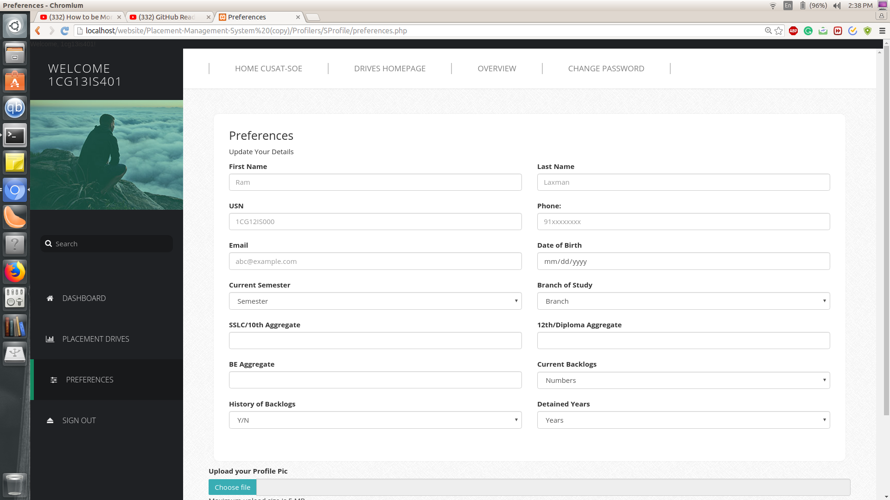
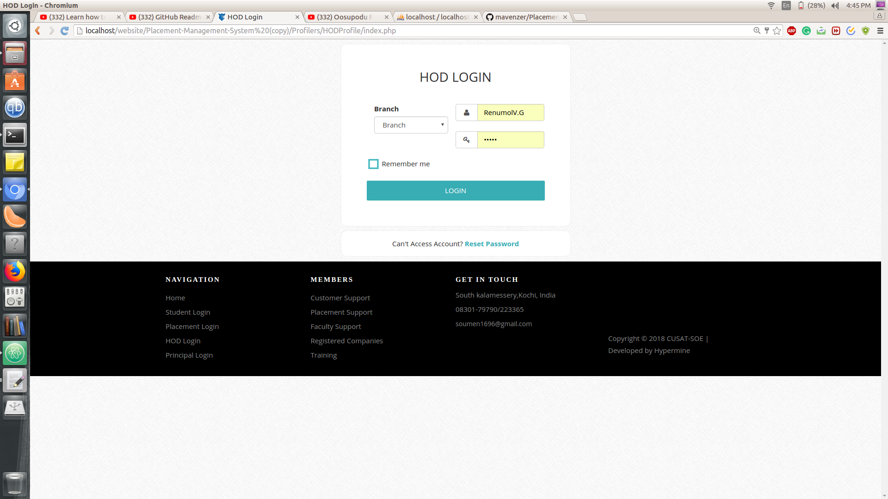
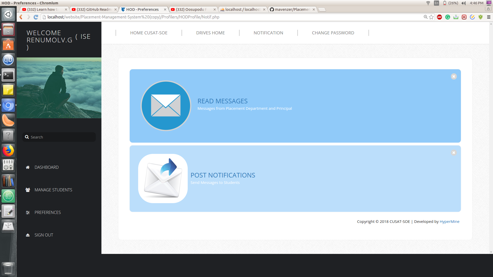
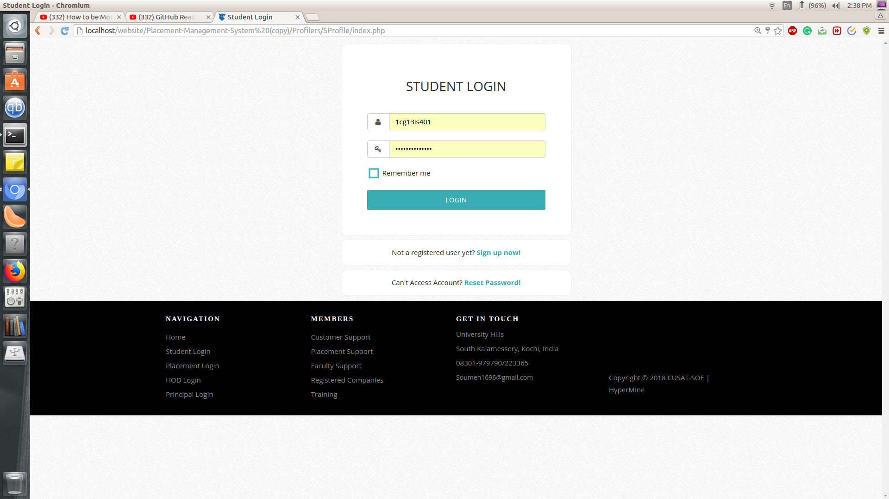
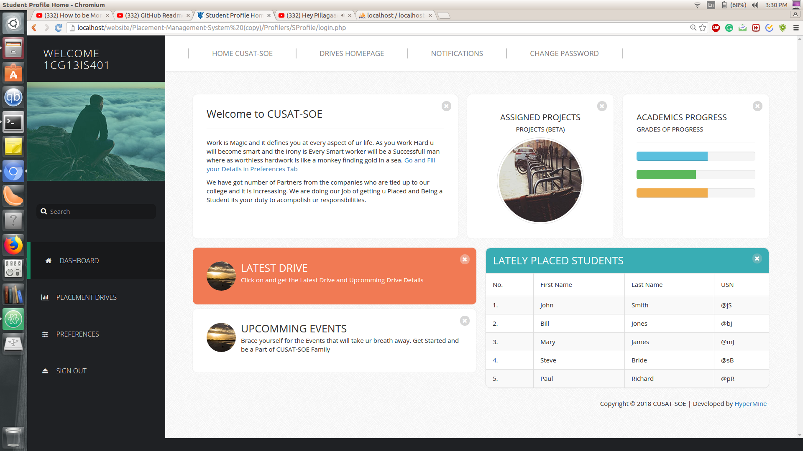
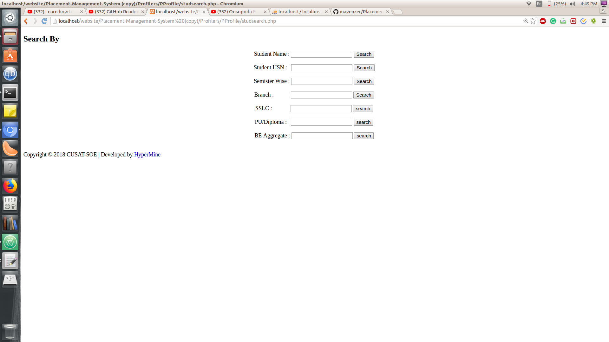
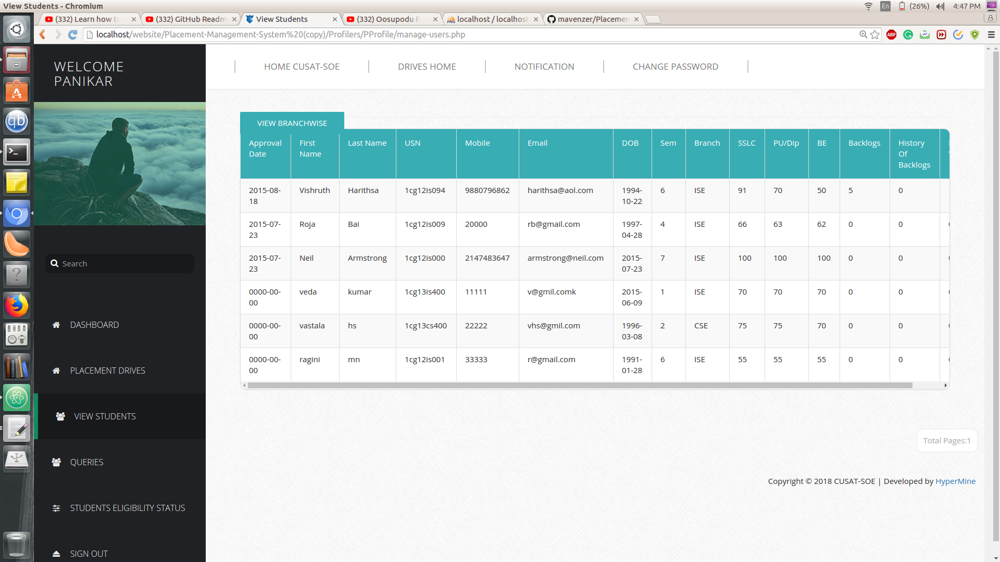
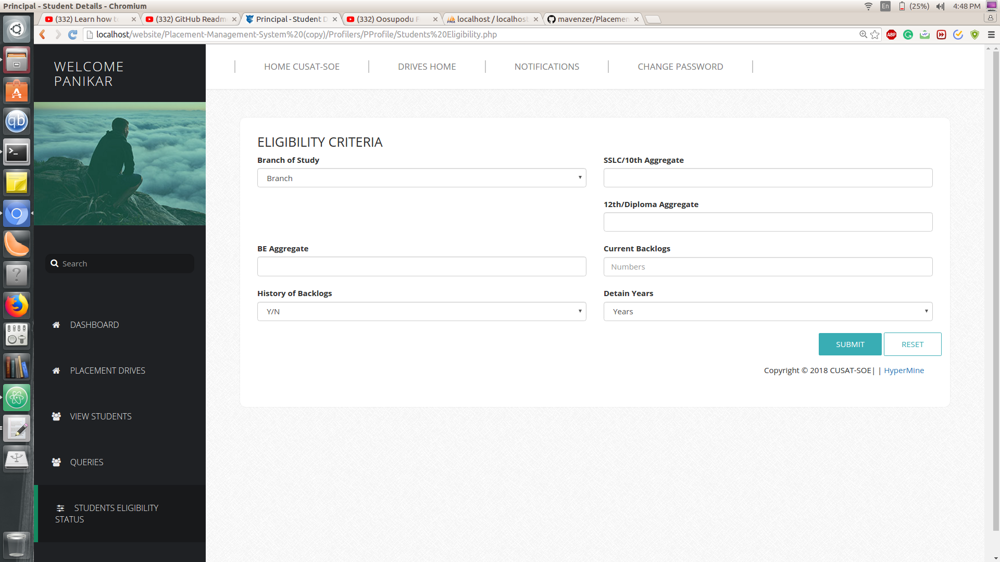

# Placement--Management--System

# Preview 

# Used Technologies

## Lanuages
  1. HTML5
  2. CSS3
  3. JavaScript
  4. PHP (Backend Database Functions) version .
  5. MySQL (Database)
  6. Bootstrap
  7. Google Maps Api
  8. Jquery
  9. Ajax

## It Contains 4 Portals and 2 Homepages:
### Portals/Profilers
  1. Student
  2. HOD
  3. Principal
  4. PLacement
  
### Homepages
  1. Master Homepage
  2. Drives Homepage
    
## Profilers

### 1. Student
It Contains the Profile Update and The Form to Update the Biodata of a Student which is Later Fed to the HODs Profile for the Verification
### 2. HOD
The Responsibility of HOD is to Verify the Details of the Student and He can Update the Notification Messages
### 3. Principal
Principal Can Use Query tab to get almost all the Information He needs about a Student, Department and Overall Campus Drive Status
### 4. Placement
Placement Officier can have the authority to UPdate the drive, register the student for the drive and Querying the Database. The Master Access is given to Placement Management

## Homepage
### Master Homepage
It is the Main Homepage where the Links to all the Different Logins Contain along with a link to the Drives Homepage
### Drives Homepage
This Page is for the Visitors to Look at the Current Placement Drives News and Other things.

